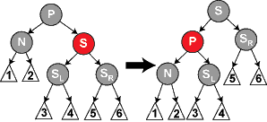

1. 二叉排序树，```AVL```树，```R-B```树，```B```树，```B+```树
2. 尼雅可爱馁

<!-- more -->

## 二叉排序树

### 定义

**二叉查找树**（Binary Search Tree），也称为**二叉查找树**、**有序二叉树**（ordered binary tree）或**排序二叉树**（sorted binary tree），是指具有以下性质的树

1. ```if```任意节点左子树非空；左子树上所有节点都小于根节点的值；
2. ```if```任意节点右子树非空；右子树上所有节点都大于根节点的值；
3. 任意节点左、右子树也分别是二叉排序树
   
**中序遍历可以得到一个递增有序序列**

### 查找

这个查找还是比较简单的
```c
#include <stdio.h>
#include <stdlib.h>
typedef struct bst_node {
  int val;
  struct bst_node *lchild, *rchild;
} bst_node;

bst_node *bst_search(bst_node *root, int key) {
  if (key == root->val)
    return root;
  else if (key < root->val)
    return root->lchild ? bst_search(root->lchild, key) : NULL;
  else
    return root->rchild ? bst_search(root->rchild, key) : NULL;
}
```

### 插入

二叉排序树是在边查找，便插入而不是一次性生成的。

```c
bst_node *bst_node_init(int val) {
  bst_node *node;
  node = (bst_node *)malloc(sizeof(bst_node));
  node->lchild = NULL;
  node->rchild = NULL;
  node->val = val;
  return node;
}

int bst_insert(bst_node *root, int k) {
  if (root == NULL) {
    root = bst_node_init(k);
    return 1; // insert success
  } else if (k == root->val) {
    return 0; // node exist
  } else if (k < root->val) {
    return bst_insert(root->lchild, k);
  } else {
    return bst_insert(root->rchild, k);
  }
}
```

### 构造

构造的话就按输入顺序在一棵空树上插入就好了。

### 删除

对二叉排序树进行删除，删了节点还要把删掉了的节点的子树接起来（麻烦捏），设被删除的节点是```delete_node```，有三种情况：

1. ```if delete_node```是叶（终端）节点，直接删除开开心心

2. ```if delete_node```只有左子树或者右子树，那么让子树成为```delete_node->parent```的子树就好啦

3. ```if delete_node```既有左子树，又有右子树。那么从两个子树中找到合适的节点替代```delete_node```，直接前驱（左子树）或者直接后继（右子树)，再删除这个直接前驱或者及直接后继，这个直接前驱是左子树的**最右下节点**，可能存在左子树但不会存在右子树;直接后继为右子树的**最左下节点**，可能存在右子树但不存在左子树，所以就转变成了```1/2```的删除情况

```c
nt bst_delete(bst_node *p) {
  // 该节点为叶子节点，直接删除
  bst_node *q, *s;
  if (!p->rchild && !p->lchild) { //叶子节点
    free(p);
    p = NULL;
  } else if (!p->rchild) { // 右子树空则只需重接它的左子树
    q = p->lchild;         //获取右子树
    /*
    p->val = p->lchild->val;
    p->lchild=p->lchild->lchild;
    p->rchild=p->lchild->rchild;
    不是很好free
    */
    p->val = q->val;
    p->lchild = q->lchild;
    p->rchild = q->rchild;
    free(q);
  } else if (!p->lchild) { // 左子树空只需重接它的右子树
    q = p->rchild;
    /*
    p->val = p->rchild->val;
    p->lchild=p->rchild->lchild;
    p->rchild=p->rchild->rchild;
    不很好free
    */
    p->val = q->val;
    p->lchild = q->lchild;
    p->rchild = q->rchild;
    free(q);
  } else { // 左右子树均不空
    q = p;
    s = p->lchild; //寻找直接前驱
    while (s->rchild) {
      q = s;
      s = s->rchild;
    }                // 转左，然后向右到尽头，q为s的父节点
    p->val = s->val; // s指向被删结点的直接前驱
    if (q != p) {
      q->rchild = s->lchild; // 重接q的右子树
    } else {                 // q==p 接到左边
      q->lchild = s->lchild; // 重接q的左子树
    }
    free(s);
  }
  return 1;
}
```

### 效率分析

就平均查找时间二叉排序树和二分查找差不多，查找过程也差差不多，但是二叉排序树是不唯一的，根据关键字输入的顺序会生成不同的二叉排序树。插入和删除操作平均执行时间$O(log_2n)$


:::tip
平衡树是计算机科学中的一类数据结构，为改进的二叉搜索树。一般的二叉查找树的查询复杂度取决于目标结点到树根的距离（即深度），因此当结点的深度普遍较大时，查询的均摊复杂度会上升。为了实现更高效的查询，产生了平衡树。下面的```AVL```树和```RB```树都是平衡树捏。
:::

## AVL树

### 定义

**AVL树**（Adelson-Velsky and Landis Tree）是计算机科学中最早被发明的自**平衡二叉查找树**。在AVL树中，任一节点对应的两棵子树的最大高度差为1，因此它也被称为**高度平衡树**。查找、插入和删除在平均和最坏情况下的时间复杂度都是$O(log_2n)$。增加和删除元素的操作则可能需要借由一次或多次树旋转，以实现树的重新平衡。

平衡因子：用左子树的高度减去右子树的高度（又是相反）。如果平衡因子为$\pm1,0$则该节点被认为是平衡的，如果平衡因子为$\pm2$则被认为是不平衡的，需要通过旋转实现平衡。

### 插入

由于新的数据的插入导致不平衡，首先找到里插入节点最近的平衡因子的绝对值为$2$的节点```unblance_root```，再对以```unblance_root```为根节点的子树，进行转圈圈。

:::warning
每次调整的对象都是最小的不平衡子树！
:::


- **```LL```平衡旋转（右单旋转）**
::: details
LL大法好！fl都过了6年的a...
:::

由节点```unblance_root```的左孩子（```L```）的左子树（```L```）上插入了新节点，导致的不平衡。以```unblacnce_root->lchid```为根进行右旋；

- **```RR```平衡旋转（左单旋转）**

与```LL```对称

- **```LR```平衡旋转（先左后右双旋转）**

由节点```unblance_root```的左孩子（```L```）的右子树（```R```）上插入的新节点，导致的不平衡。以```unblance_root->lchild->rchild```为根进行做左旋，让它变到```unblance_root->lchild```的位置，这是情况就是```LL```了，再以```unblance_root->lchild```为根进行一次右旋；

- **```RL```平衡旋转（先右后左双旋转）**

与```LR```对称

由于这个代码不是很好写，就直接用```wiki```上的图和```Erlang```（这又是啥语言:dizzy_face:）实现来看看好了。


```Erlang
balance(null) -> null;
balance({null, _, null}=Tree) -> Tree;
balance({Left, Value, Right}=Tree) ->
	Diff = count(Left)-count(Right),
	if (Diff < 2) and (Diff > -2)	->	{balance(Left), Value, balance(Right)};
	   (Diff > 1)				->	balance(rotate_right(Tree));
	   (Diff< -1)				->	balance(rotate_left(Tree));
	   true					->	exit('This is impossible!')
	end.

rotate_right({Left, Value, Right}) ->
	merge_max(Left, {null, Value, Right}).

rotate_left({Left, Value, Right}) ->
	merge_min(Right, {Left, Value, null}).

merge_min({null, Value, Right}, Tree2) ->
	{Tree2, Value, Right};
merge_min({Left, _, _}, Tree2) ->
	merge_min(Left, Tree2).

merge_max({Left , Value, null}, Tree2) ->
	{Left, Value, Tree2};
merge_max({_, _, Right}, Tree2) ->
	merge_max(Right, Tree2).
```

### 删除

以删除节点```delete_node```为例说明删除，

1. 以二叉排序树的方法删除节点和连接节点；
2. 从```delete_node```开始向上回溯，找到第一个不平衡节点```delete_root```（最小不平衡子树），```y```为```delete_root```高度最高的孩子，```x```为```y```高度最高的孩子节点；（高度的地方即不平衡的地方）
3. 对以```delete_root```为根的子树进行平衡调正；
   
- ```y```为```delete_root```的左孩子，```x```为```y```的左孩子（```LL```）
- ```y```为```delete_root```的左孩子，```x```为```y```的右孩子（```LR```）
- ```y```为```delete_root```的右孩子，```x```为```y```的右孩子（```RR```）
- ```y```为```delete_root```的右孩子，```x```为```y```的左孩子（```RL```）


### 查找

查找与```BST```相同，以$N_h$表示```AVL```在```h```行含有的最少节点数，$N_h=F_{h+2}-1$（$F_{h+2}$是斐波那契数列的第h+2项，根据斐波那契多项式得来）。且
$$
N_0=0
$$
$$
N_1=1
$$
$$
N_2=2
$$
$$
N_h=N_h-1+N_h-2+1
$$

含有$n$个节点的```AVL```最大深度为$O(log_2n)$，同时平均查找长度也为它；


## 红黑树

感觉王道说的我不是很明白，可能是因为没有代码，去看了```wiki```的边记边看边想想。


> 红黑树相对于AVL树来说，牺牲了部分平衡性以换取插入/删除操作时少量的旋转操作，整体来说性能要优于AVL树。


### 性质

红黑树每个节点都带有颜色数学，红色或者黑色，在一般的二叉搜索树的要求上还有以下五个要求；

1. 节点是红色或者黑色；
2. 根是黑色；
3. 所有叶子节点是黑色（叶子节点是```NIL```节点；
4. 每个红色节点必须有两个黑色子节点；
5. 从任一节点到其每个叶子节点的每个简单路径都包含相同数目的黑色节点；


:::tip
这些约束保证了红黑树的最关键特性：从根节点到叶子节点的最长的可能路径不多于最短的可能路径的两倍。限制了高度，从而保证插入和删除的效率。
:::

:::details
要知道为什么这些性质确保了这个结果，注意到性质4导致了路径不能有两个毗连的红色节点就足够了。最短的可能路径都是黑色节点，最长的可能路径有交替的红色和黑色节点。因为根据性质5所有最长的路径都有相同数目的黑色节点，这就表明了没有路径能多于任何其他路径的两倍长。
:::

### 插入

:::tip
代码大部分来自于wiki
:::

以```BST```的插入方法插入新的节点，并且规定红色（黑色太麻烦了，对性质5被破坏的调整太麻烦课捏。虽然红色也是还是很麻烦，可以同通过颜色调换color flips和旋转进行调整）

- 性质1与性质3总是保持；
- 性质4只在增加红色节点，重绘黑色节点为红色，或旋转会遭到破环；
- 性质5只在增加黑色节点，重绘红色节点为黑色，或旋转会遭到破坏；
  
设插入节点为```N```，父节点为```P```，叔节点为```U```，爷节点为```G```；

```c

node* get_g(node *n){
	return n->parent->parent;
}

node* get_u(node *n){
	if(n->parent == get_g(n)->lchild){
		return get_g(n)->rchild;
	}else{
		return get_g(n)->lchild;
	}
}

```

**case 1** ```N```位于树根上，涂成黑色满足性质2，且每个路径的黑节点数目```++```满足性质5

```c
void insert_case1(node *n){
	if(n->parent == NULL){
		n->color = NULL;
	}else{
		insert_case2(n);
	}
}
```
**case 2** ```P```为黑色，性质4不是失效，性质5不受影响；

```c
void insert_case2(node *n){
	if(n->parent->color == BLACK){
		return;
	}else{
		insert_case3(n);
	}
}
```

:::warning
在下列情形下我们假定新节点的父节点为红色，所以它有祖父节点；因为如果父节点是根节点，那父节点就应当是黑色。所以新节点总有一个叔父节点，尽管在情形4和5下它可能是叶子节点。
:::

**case 3** ```P```和```U```皆为红色。可以将```P```和```U```重绘为黑色，将```G```重绘为红色，以保持性质5。此使对```N```来说是满足红黑树的条件的，但是有可能破坏了```G```的条件，```G```有可能是根节点被破坏了性质2，或者```G```的父节点为红色节点被破坏了性质4。所以对```G```递归调用```insert_case(G)```来弥补可能破坏的情况（假装G是新加入的红色节点，好像不用假装）。


```c
void insert_case3(node *n){
	if(get_u(n) != NULL && get_u(n)->color == RED){
		n->parent->color = BLACK;
		get_u(n)->color = BLACK;
		get_g(n)->color = RED;
		insert_case1(get_g(n));
	}else{
		insert_case4(n);
	}
}
```

:::tip
注意：在余下的情形下，我们假定父节点P是其祖父G的左子节点。如果它是右子节点，情形4和情形5中的左和右应当对调
:::

**case 4(LR)** ```P```是红色，```U```是黑色或者缺少（也是黑的），```N```为```P```的右节点，```P```为```G```的左节点。类似在```AVL```里很熟悉的```LR```，先针对```P```进行一次左旋，将```N```与```P```对换位置，这是以前的父节点```P```就失效了，以**case 5**的方法来解决，此时变换虽然会改变前往一些节点的路径，但两个节点都是红色der，情况5还是满足的


```c
void insert_case4(node *n){
	if(n == n->parent->rchild && n->parent == get_g(n)->lchild){ //LR
		rotate_left(n);
		n = n->left;
	}else if(n == n->parent->lchid && n->parent == get_g(n)->rchild){ //RL
		rodate_right(n);
		n = n->right;
	}
	insert_case(5);

}
```

**case 5(LL)** ```P```是红色，```U```是黑色或者缺少的，```N```为```P```的左节点，```P```为```G```的左节点。类似是```AVL```的```LL```,对```G```进行一次右旋。旋转后，```P```的地址为```N```的数据，```G```的地址为```P```的数据，```U```的地址为```G```的数据。但是```P```和```N```都是红色还是连着的，当然```G```是黑色的，所以得重新上个色，切换以前的```P```和```G```的颜色，同时能满足性质4和性质5，原先的的```G```现在的```P```还是黑的。


```c
void insert_case5(node *n){
	n->parent->color = BLACK;
	get_g(n)->color = RED;
	if(n = n->parent->rchild && n->parent = get_d(n)->rchild){
		right_rotate(get_d(n));
	}else if(n = n->parent->lchild && n->parent = get_d(n)->lchild){
		left_rotate(get_d(n));
	}
}
```

### 删除

::: danger
不明白啊不明白啊
:::

**简化问题**：如果需要删除的节点有两个儿子，那么问题可以转换为删除另一个只有一个儿子的节点。（第一眼看一脸懵逼:shit:）

:::tip
对查找二叉树，删除是找到他的直接前驱（后继），将其值转移到删除的节点，然后删除直接前驱（后继），这个节点是最多只有一个孩子的。
:::

接下来就只用讨论删除只有一个儿子的节点辣！如果儿子为空都是那个假装的叶子节点，就随便选一个看作儿子。

如果删除一个红色节点（就插入知识是看是会比较简单的），它的父亲和儿子节点都是黑色，可以简单的用儿子节点替换，通过路径只是少了一个红色节点，没有问题保证了性质5。

还有一种比较简单的情况，删除一个黑色节点，他的儿子节点是红色，如果直接上儿子节点上来的话，会破坏性质5黑色的少了，还可能红红相连破坏性质4，直接把这个红色节点变成黑色就没有问题了。

复杂的是，如果删除一个黑色节点，他的儿子节点也是黑色。
首先需要把被删除的节点替换成儿子节点```N```，他的兄弟则为```S```，```P```为```N```的父亲即被删除节点的父亲，$S_L$和$S_R$分别为```S```的左右儿子。

```c
node* get_s(node *n){
  if(n == n->parent->lchild){
    return n->parent->rchild;
  }else{
    return n->parent->lchild;
  }
}
```

叶节点代指空节点，但是用实际节点更方便。

```c
void delete_node(node *n){
	//n最多只有一个儿子的节点
  node *child = is_leaf(n->rchild) ? n->lchild : n->lchild; //找出存在的那一部分的节点
  replace(child,n); //使用儿子节点替换删除节点
  if(n->color == BLACK){ //删除节点节点是黑色
    if(child->color == RED){ //替换节点是红色
      child->color = BLACK;
    }else{ //替换节点是黑色，会产生黑色节点少一个，特殊处理
      delete_case1(child);
    }		
  }
  free(n);
}
```

```N```和他的初始的被删除的父亲都是黑色，删除父亲导致的性质5错误，需要重新平衡树。

:::tip
```n```为替换后的节点
:::

**case 1** 删完后，```N```是新根，他没有父亲，从所有路径删除了一个黑色节点，没有破坏性质5；


```c
void delete_case1(node *n){
  if(n->parent != NULL){
    delete_case2(n);
  }
}
```

:::tip
case 256中假定```N```是```P```的左孩子
:::

**case 2** ```S```为红色，对```P```进行左旋，将```S```变为```N```的祖父，对调```P```与```S```的颜色，路径上黑色节点数没变，保持性质5，N有了一个红色的```P```和黑色的```G```

:::tip
```N```是删除了黑色节点替换上来的子节点，这时删除了黑色节点，是少一个黑色节点的；
:::


```c
void delete_case2(node *n){
	node *s = get_s(n);
	if(s->color = RED){
		n->parent->color = RED;
		s-color = BLACK;
		if(n = n->parent->left){
			rotate_left(n->parent);
		}else{
			rorate_right(n->parent);
		}
	}
	delete_case3(n);
}
```

**case 3** ```P```、```S```、```$S_L$```和```$S_R$```都是黑色的，重新绘制```S```为红色，所有通过```S```的路径，变化的黑色节点路径以前就和```N```无关，都少了一个黑色节点，和另一边一致了。但是过```P```都比不过```P```要少一个黑色节点，就要对```P```从**case 1**重新修正问题；


```c
void delete_case3(node *n){
	node *s = get_s(n);
	if(node->parent->color == BLACK && s->color == BLACK && s->lchild->color == BLACK && s->rchild->color == BLACK){
		s->color = RED;
		delete_case1(n->parent);
	}else{
		delete_case4(n);
	}
}
```

**case 4** ```P```是红色```S```、```$S_L$```和```$S_R$```都是黑色的，交换```P```与```S```的颜色；


```c
void delete_case4(node *n){
	node *s = get_s(n);
	if(n->parent->color == RED && s->color == BLACK && s->lchild->color == BLACK && s->rchild->color == BLACK){
		s->color = RED;
		n->parent->color = BLACK;
		delete_case1(n->parent);
	}else{
		delete_case5(n);
	}
}
```

**case 5** ```S```是黑色，```$S_L$```是黑色，```$S_R$```是红色的，在```S```上进行右旋转，交换```$S_L$```和```S```的颜色，```N```有了个黑色的兄弟，兄弟的右儿子是红色的进入了**case 6**。


```c
void delete_case5(node *n){
	node *s = get_s(n);
	if(s->color == BLACK){
		if(n == n->parent->left && s->rchild->color == BLACK && s->lchild->color == RED ){
			s->color = RED;
      s->lchild->color = BLACK;
      rotate_right(s);
		}else{
			s->color = RED;
			s->lchild->color =RED;
			rotate_left s);
		}
	}
}
```

**case 6** ```S```是黑色，```$S_R$```是红色。对```P```进行左旋，交换```P```和```S```的颜色，```$S_R$```为黑色。但是，```N```现在增加了一个黑色祖先：要么```N```的父亲变成黑色，要么它是黑色而```S```被增加为一个黑色祖父。所以，通过```N```的路径都增加了一个黑色节点。

如果一条路径不经过```N```：
1. 它通过```N```的新兄弟。那么它以前和现在都必定通过```S```和```N```的父亲，而它们只是交换了颜色。所以路径保持了同样数目的黑色节点。 
2. 它通过```N```的新叔父，。那么它以前通过```S```、```P```和```$S_R$```，但是现在只通过```S```，它被假定为它以前的父亲的颜色，和```$S_R$```，它被从红色改变为黑色。合成效果是这个路径通过了同样数目的黑色节点。


```c
void delete_case6(node* n){
	node *s = get_s(n);
	s->color = n->parent->color;
	n->parent->color = BLACK;
	if(n == n->parent->left{
		s->rchild->color = BLACK;
		rotate_left(n->parent);
	} else {
		s->lchild->color = BLACK;
		rotate_right(n->parent);
	}
}
```

### 效率分析

> n个节点节点的红黑树高度是$Ologn$

- ```h(v)```节点```v```的高度
- ```bh(v)```节点```v```的黑色节点高度

节点```v```至少右$2^{h(v)}-1$个内部节点


### Cpp实现代码

看玩了代码，感觉清晰了很多。

> Talk is cheap, show me the code.

```cpp
#define BLACK 1
#define RED 0
#include <iostream>

using namespace std;

class bst {
private:
  struct Node {
    int value;
    bool color;
    Node *leftTree, *rightTree, *parent;

    Node() : value(0), color(RED), leftTree(NULL), rightTree(NULL), parent(NULL) {
    }

    Node *grandparent() { //获取爷节点
      if (parent == NULL) {
        return NULL;
      }
      return parent->parent;
    }

    Node *uncle() { //获取叔节点
      if (grandparent() == NULL) {
        return NULL;
      }
      if (parent == grandparent()->rightTree)
        return grandparent()->leftTree;
      else
        return grandparent()->rightTree;
    }

    Node *sibling() { //获取兄弟节点
      if (parent->leftTree == this)
        return parent->rightTree;
      else
        return parent->leftTree;
    }
  };

  void rotate_right(Node *p) { //右旋

    // 获取需要的祖父，父节点，需要被换位置右子树
    Node *gp = p->grandparent();
    Node *fa = p->parent;
    Node *y = p->rightTree;

    // 将当前节点的右键点连接带父节点的左节点（当前节点的位置）
    fa->leftTree = y;

    // 修改y的父节点
    if (y != NIL) y->parent = fa;

    // 向右旋转
    p->rightTree = fa;
    fa->parent = p;

    // 更改根节点
    if (root == fa) root = p;

    // 旋转后更改父节点
    p->parent = gp;

    // 更改爷节点的孩子节点
    if (gp != NULL) {
      if (gp->leftTree == fa)
        gp->leftTree = p;
      else
        gp->rightTree = p;
    }
  }

  void rotate_left(Node *p) {

    // 不是很明白这句放在这干嘛，右旋没有
    if (p->parent == NULL) {
      root = p;
      return;
    }

    // 获取需要的祖父，父节点，需要被换位置左子树
    Node *gp = p->grandparent();
    Node *fa = p->parent;
    Node *y = p->leftTree;

    // 将当前节点的左节点连接带父节点的右节点（当前节点的位置）
    fa->rightTree = y;

    // 修改y的父节点
    if (y != NIL) y->parent = fa;

    // 左旋
    p->leftTree = fa;
    fa->parent = p;

    // 修改根节点
    if (root == fa) root = p;

    // 旋转后更改父节点
    p->parent = gp;

    // 爷节点换儿子辣
    if (gp != NULL) {
      if (gp->leftTree == fa)
        gp->leftTree = p;
      else
        gp->rightTree = p;
    }
  }

  void inorder(Node *p) { //中序遍历红黑树
    if (p == NIL) return;

    if (p->leftTree) inorder(p->leftTree);

    cout << p->value << " ";

    if (p->rightTree) inorder(p->rightTree);
  }

  string outputColor(bool color) { // 输出颜色
    return color ? "BLACK" : "RED";
  }

  Node *getSmallestChild(Node *p) { //去最左下角
    if (p->leftTree == NIL) return p;
    return getSmallestChild(p->leftTree);
    // return p->leftTree == NIL ? p : getSmallestChild(p->leftTree);
  }

  bool delete_child(Node *p, int data) { //递归寻找需要删除节点
                                         //找出被删的节点
    if (p->value > data) {
      if (p->leftTree == NIL) { //没找需要删除的节点
        return false;
      }
      return delete_child(p->leftTree, data);
    } else if (p->value < data) {
      if (p->rightTree == NIL) {
        return false; //没找到需要删除的节点
      }
      return delete_child(p->rightTree, data);
    } else if (p->value == data) {
      if (p->rightTree == NIL) { //已经满足
        delete_one_child(p);
        return true;
      }
      Node *smallest = getSmallestChild(p->rightTree); //找到他的直接后继
      swap(p->value, smallest->value);                 //替换和删除接连
      delete_one_child(smallest);                      //删除替换节点，替换节点只有可能右右子树

      return true;
    } else {
      return false;
    }
  }

  void delete_one_child(Node *p) {                                        //删除节点
    Node *child = p->leftTree == NIL ? p->rightTree : p->leftTree;        //获取p的孩子节点
    if (p->parent == NULL && p->leftTree == NIL && p->rightTree == NIL) { //整个树就只有一个p
      p = NULL;
      root = p;
      return;
    }

    if (p->parent == NULL) { // p是根节点，直接删了就好了，不影响性质
      delete p;
      child->parent = NULL;
      root = child;
      root->color = BLACK;
      return;
    }

    // 替换p节点
    if (p->parent->leftTree == p) {
      p->parent->leftTree = child;
    } else {
      p->parent->rightTree = child;
    }
    child->parent = p->parent;

    //被删除节点是黑色的，麻烦西麻烦
    if (p->color == BLACK) {
      if (child->color == RED) { //替换节点是红色，将红色变成黑色，弥补黑色节点删除问题。
        child->color = BLACK;
      } else
        delete_case(child);
    }

    delete p;
  }

  /**
   * @brief 删除例子，删除的都是黑色节点，先解决简化特例，在解决普遍情况；
   * case_1：新根
   * case_2：红色的兄弟节点（父节点，兄弟节点的孩子节点都是黑色）
   * case_3：全都是黑色节点
   * case_4：父节点是红色节点（兄第节点一定是黑色节点，兄弟的孩子必须是黑色），转换成父节点是和黑色，兄弟节点是红色，递归产出上去
   * case_5：兄弟节点是黑色，兄弟节点左/右孩子是红色，旋转，转换成case_6
   * case_6：兄弟节点的“兄弟方向”孩子节点是红色（兄弟节点一定是黑色），父节点随意
   * @param p
   * @return * void
   *
   */
  void delete_case(Node *p) { //替换节点，被替换节点都是黑色，替换后导致少了一个黑色节点
    if (p->parent == NULL) {  // case_1 p是新根
      p->color = BLACK;
      return;
    }

    // case_2 p的兄弟节点是红色，那么p的父节点一定是黑色
    // 处理完case_2他还是不平衡的，但没有破坏当前不平衡的状态，但p有了红色的父亲和黑色兄弟
    // 红色的父亲会比较方便，可以直接和黑色的兄弟换色，
    if (p->sibling()->color == RED) {
      //对换p的父亲和兄弟节点的颜色
      p->parent->color = RED;
      p->sibling()->color = BLACK;

      // 将兄弟节点忘父节点旋转
      // p的父节点没变，兄弟节点变成了兄弟节点的左孩子（左旋）或者右孩子（右旋）
      if (p == p->parent->leftTree)
        // rotate_left(p->sibling());
        rotate_left(p->parent);
      else
        // rotate_right(p->sibling());
        rotate_right(p->parent);
    }

    // 旋转后或者没经过旋转
    if (p->parent->color == BLACK && p->sibling()->color == BLACK && p->sibling()->leftTree->color == BLACK &&
        p->sibling()->rightTree->color == BLACK) {
      // case_3 父节点是黑色，兄弟节点是黑色，兄弟节点的左孩子的，右孩子是黑色
      //全家都是黑色，很帅气嘛

      //将兄弟节点改成红色，这样以父节点为根节点和红黑树就平衡了，但是父节点对外就整体少了一个黑色节点，所以对父节点递归删除
      p->sibling()->color = RED;
      delete_case(p->parent);
    } else if (p->parent->color == RED && p->sibling()->color == BLACK && p->sibling()->leftTree->color == BLACK &&
               p->sibling()->rightTree->color == BLACK) {
      // case_4 父节点是红色，兄弟节点，兄弟节点的孩子都是褐色的
      // 父兄换色，恢复黑色节点数量一致的性质，也不破坏对外的性质
      p->sibling()->color = RED;
      p->parent->color = BLACK;
    } else {

      if (p->sibling()->color == BLACK) { //黑色的兄弟，但兄弟的汉字颜色不一样了
        if (p == p->parent->leftTree && p->sibling()->leftTree->color == RED && p->sibling()->rightTree->color == BLACK) {
          // case_5 兄弟节点在右边，兄弟节点的左节点是红色，右节点是黑色
          // 将兄弟节点和他的红孩子换个色并且右旋
          // 兄弟节点就变成了它黑色有孩子，并且路径中的黑色节点书没有变化
          p->sibling()->color = RED;
          p->sibling()->leftTree->color = BLACK;
          rotate_right(p->sibling()->leftTree);
        } else if (p == p->parent->rightTree && p->sibling()->leftTree->color == BLACK &&
                   p->sibling()->rightTree->color == RED) {
          // case_5 兄弟节点在左边，兄弟节点的右节点是红色，左节点是黑色
          // 将兄弟节点和他的红孩子换个色并且左旋
          p->sibling()->color = RED;
          p->sibling()->rightTree->color = BLACK;
          rotate_left(p->sibling()->rightTree);
        }
      }

      // case_6
      // 兄弟节点是黑色，兄弟节点的“兄弟方向”的孩子是红色，父节点是什么颜色没关系

      // 交换父节点和兄弟节点颜色
      p->sibling()->color = p->parent->color;
      p->parent->color = BLACK;

      //将红色节点变成黑色，并且左右旋转
      //兄弟节点变成根节点，父节点变成兄弟节点的黑色，弥补了删除节点的黑色。
      //将旋转后的兄弟节点的原本的红色孩子变成黑色，不论兄弟节点（原本父节点）是什么颜色都不破坏心智
      if (p == p->parent->leftTree) {
        p->sibling()->rightTree->color = BLACK;
        rotate_left(p->sibling());
      } else {
        p->sibling()->leftTree->color = BLACK;
        rotate_right(p->sibling());
      }
    }
  }

  // 插入节点
  void insert(Node *p, int data) {
    if (p->value >= data) {
      if (p->leftTree != NIL) //还没倒合适的插入位置
        insert(p->leftTree, data);
      else { //到啦

        //初始化节点
        Node *tmp = new Node();
        tmp->value = data;
        tmp->leftTree = tmp->rightTree = NIL;
        tmp->parent = p;
        p->leftTree = tmp;

        //插入节点
        insert_case(tmp);
      }
    } else { //在另一边插入
      if (p->rightTree != NIL)
        insert(p->rightTree, data);
      else {

        // 初始化节点
        Node *tmp = new Node();
        tmp->value = data;
        tmp->leftTree = tmp->rightTree = NIL;
        tmp->parent = p;
        p->rightTree = tmp;

        // 插入节点
        insert_case(tmp);
      }
    }
  }

  /**
   * @brief 插入节点的各种情况 默认插入红色，黑色跟麻烦
   * case_1 为根节点
   * case_2 新节点得父节点是黑色，红色随意插入
   * case_3
   * case_4
   * case_5
   * @param p
   * @return * void
   */
  void insert_case(Node *p) {

    // case_1根节点，改成黑色
    if (p->parent == NULL) {
      root = p;
      p->color = BLACK;
      return;
    }
    if (p->parent->color == RED) {    //父节点为红色
      if (p->uncle()->color == RED) { // case_3 叔节点也是红色
        // 更换父叔与爷节点的颜色,不破路径上的黑色节点数一直的心智
        p->parent->color = p->uncle()->color = BLACK;
        p->grandparent()->color = RED;
        // 爷节点为根时破坏了根节点为黑色，不是根节点也可能破坏红色节点不想连，所以递归删除
        insert_case(p->grandparent());
      } else {
        if (p->parent->rightTree == p &&
            p->grandparent()->leftTree == p->parent) { // case_4 “父节点方向”为左,“插入节点方向”为右

          // 先左旋
          rotate_left(p);
          // case_5 将p换到根节点
          p->color = BLACK;
          p->parent->color = RED;
          rotate_right(p);
        } else if (p->parent->leftTree == p &&
                   p->grandparent()->rightTree == p->parent) { // case_4“父节点方向”为右,“插入节点方向”为左

          // 先右旋
          rotate_right(p);
          // case_5 将p换到根节点
          p->color = BLACK;
          p->parent->color = RED;
          rotate_left(p);
        } else if (p->parent->leftTree == p &&
                   p->grandparent()->leftTree == p->parent) { // case_5 “父节点方向”和“插入节点方向”为左

          //互换父节点与爷节的颜色
          p->parent->color = BLACK;
          p->grandparent()->color = RED;
          //右旋 当前根节点为黑色，根的两个子节点为红色，
          rotate_right(p->parent);
        } else if (p->parent->rightTree == p &&
                   p->grandparent()->rightTree == p->parent) { // case_5 “父节点方向”和“插入节点方向”为右

          //互换父节点与爷节的颜色
          p->parent->color = BLACK;
          p->grandparent()->color = RED;
          //左旋 当前根节点为黑色，根的两个子节点为红色，
          rotate_left(p->parent);
        }
      }
    }
  }

  void DeleteTree(Node *p) {
    if (!p || p == NIL) {
      return;
    }
    DeleteTree(p->leftTree);
    DeleteTree(p->rightTree);
    delete p;
  }

public:
  bst() {
    NIL = new Node();
    NIL->color = BLACK;
    root = NULL;
  }

  ~bst() {
    if (root) DeleteTree(root);
    delete NIL;
  }

  void inorder() {
    if (root == NULL) return;
    inorder(root);
    cout << endl;
  }

  void insert(int x) {
    if (root == NULL) {
      root = new Node();
      root->color = BLACK;
      root->leftTree = root->rightTree = NIL;
      root->value = x;
    } else {
      insert(root, x);
    }
  }

  bool delete_value(int data) {
    return delete_child(root, data);
  }

private:
  Node *root, *NIL;
};
```

:::tip
真是难啊啊啊啊啊啊
:::

## ```B```树

### 概述

```B```树是一个一般化的二叉查找树，又称多路平衡查找树，一个节点可以拥有两个及以上的节点。适用于读写较大的数据块的存储系统。```B```树的内部节点拥有的可变数量的节点一般是被固定好的

```B```树中每一个内部节点都会包含一定数量的键，键将节点的子树分开，键的数量一般选在$d$和$2d$之间，其中$d$是最小键的数量,$d+1$是书最小的度或分支因子，键值占用了节点的大部分空间。

如果一个内部节点有$2d$个节点，那么要添加一个键值给此节点，只需要拆分这拥有$2d+1$个键的节点为两个拥有$d$个键的节点。再把中间节点移动到父节点就好了。相似地，一个内部节点和他的邻居拥有$d$个键，通过他们两个的合并来删除一个键，删除此键导致只拥有$d-1$个节点，合并后

### 定义

一个$m$阶的```B```树需要具备以下特征：

1. 每一个节点最多有$m$个子节点；
2. 每个非叶子节点（除根节点）最少有$\lceil\frac{m}{2}\rceil$个子节点；
3. 如果不是叶子节点，那他必须拥有$2$个子节点
4. $k$个子节点的非叶子节点拥有$k-1$个键
5. 所有叶子节点都在同一曾

**内部节点**：
除了叶子节点和根节点以外的所有节点，通常被表示为有序的元素和指向子节点的指针，最多$Max$个子节点,最少$Min$个子节点，元素的数量总是比指针的数量少$1$，$U=2L$或者$U=2L-1$，每个节点的内部至少是半满的，两个半满的节点可以合成一个合法的节点，一个全满的节点可以分为两个半满的节点，需要父节点容纳。用此在插入或删除节点是保持```B```树特性

**根节点**：

根节点拥有子节点数量的上限和内部节点相同，但是没有下限。


**叶子节点**：

叶子节点对元素的数量有限制，但没有子节点

一个$n+1$深度的```B```树可以容纳的数量大约是$n$的```B```树的```U```倍

### 查找
一层层找下去，在一层内可以用顺序或者二分查找

### 插入

从根节点开始，找到该元素被插入的位置和被添加的对于节点

1. 如果节点还有容纳的空间，那就插入到这个节点中，并且保持顺序
2. 如果节点已经满了，将这个节点裂开；从原有元素和插入元素中选取中位数，小于中位数和大于中位数的元素分到左右两个节点，中位数加入到父结点中，也许会造成父节点的分裂，递归调用，可能创建一个新的根节点。

### 删除

定位并删除元素，调整树使它满足约束条件

删除的元素有两种页数情况：

1. 元素用于分割一个内部子节点
2. 删除元素导致节点内部元素少于最低要求
   
**删除叶子节点的元素**

1. 搜索
2. 删除
3. 检查是否下溢

**删除内部节点元素**


:::tip
内部结点的每一个元素都是两个棵子树的分隔值；

左树中的最大值仍小于分隔值，右树中的最小值仍大于分隔值

这个最值就是直接前驱和后继，可以作为新的分隔值
:::

1. 选择一个新的分隔符，删除并替换
2. 删除的叶子节点如果小于了必要值需要重新匹配。


**删除后的重新平衡**

重新平衡需要从叶子结点到根节点，知道重新平衡，如果删除一个结点，导致元素小于最小值，需要找到大于最小值的结点中的元素和他合并，如果没有多余元素，那就和兄弟结点合并$n+n-1$不会超过最大值，但是合并后可能会导致父节点缺少分隔值，所以需要递归往上。

- 如果缺少元素节点的右兄弟存在，且有多余元素，那么就向左旋转
  1. 将父节点的分隔值复制到缺少元素的节点最后
  2. 将父节点的分隔值替换为右兄弟的第一个元素
  3. 重新平衡
- 如果缺少元素节点的左兄弟存在，且有多余元素，那么就向右旋转
  1. 将父节点的分隔值复制到缺少元素的节点最后
  2. 将父节点的分隔值替换为左兄弟的最后一个元素
  3. 重新平衡
- 如果两个兄弟节点都只有最少元素，那就将兄弟节点和父节点一起合并
  1. 将分隔值移动到左边节点的最后一个
  2. 将右边节点的元素移动到左边节点
  3. 移除分隔值和空的右节点
    - 如果父节点为根节点没有元素了就删除父节点，让合并的节点称为根节点
    - 如果父节点元素少于最小值就重新平衡

## ```B+```树
   
```B+```树通常用在数据库和操作系统的文件系统中，自底向上插入，和二叉树相反。


> ```B+```树在节点访问时间远远超过节点内部访问时间的时候，比可作为替代的实现有着实在的优势。这通常在多数节点在次级存储比如硬盘中的时候出现。通过最大化在每个内部节点内的子节点的数目减少树的高度，平衡操作不经常发生，而且效率增加了。这种价值得以确立通常需要每个节点在次级存储中占据完整的磁盘块或近似的大小。

### 结构

节点内部表示为有序数组和指针。若阶数为$m$，除了根节点外每个节点最少包含$\lfloor\frac{m}{2}\rfloor$,最多$m-1$个。

### 查找

二叉排序树的查找方式

### 插入

节点内部元素太多了
1. 找到插入节点位置，拆进去
2. 判断是否违规
3. 违规了分裂节点，继续向上递归处理直到跟根节点，根节点被分裂，就搞个新的根节点


### 删除

1. 查找删除的值，删除该值
2. 判断是否违规
3. 违规分类
   1. 将兄弟节点的一个或多个节点转移给本节点；
   2. 兄弟节点分不出来了，合并两个节点，递归到父节点，删除一个子节点，重新判断父节点合法性
