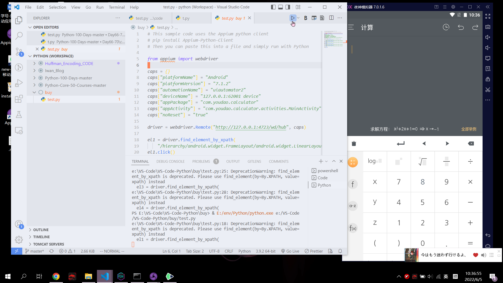

<!-- more -->
## 《软件测试和质量管理》实验报告

学号： 2019329621244 		姓名： 张耀文       

实验内容：       使用appium+nox+python进行移动端测试                         
### 一、目的和要求
使用 Appium 对安卓计算器进行移动应用测试。

### 二、实验内容
（1） 完成测试环境配置；

（2） 利用Appium录制操作，并导出测试脚本（Python）；

（3） 在 Pycharm 中打开测试脚本并执行，查看实际测试效果。
### 三、实验要求

（1）撰写实验报告，主要填写本人测试步骤和自己的实验体会。

（2）提交录制的测试脚本。

（3）提交检测结果。

### 四、实验步骤
1.配置环境（java，python，android，node，appium，nox）

由于java，python，node， android和nox都是之前使用过的所以没有配置过程的截图，nox为安卓模拟器也需要配置到环境变量里，它的adb和android的adb版本肯能不一样，可能会导致连接失败的问题。

替换adb，从abdroid sdk里把adb去出，复制两份其中一份命名为nox_adb.exe，替换nox原先文件。

 
安装appium
 


启动nox（夜神模拟器）


检查设备


 
在模拟器里打开计算器，查看包名的等信息


打开appium


启动服务，点击左上角的搜索图片，经行session配置


 
进行设备信息的配置


获取模拟器系统版本


 
配置文件

```json
{
  "platformName": "Android",
  "platformVersion": "7.1.2",
  "automationName": "uiautomator2",
  "deviceName": "127.0.0.1:62001 device",
  "noReset": "true",
  "appPackage": "com.youdao.calculator",
  "appActivity": "com.youdao.calculator.activities.MainActivity"
}
```

启动session，在这里出错的可能最大，有可能是环境变量没配置好或者模拟器环境变量版本问题，有可能是启动程序没有设定正确包，设备没有成功连接等。启动成功后会自动打开所选定的程序。
> An unknown server-side error occurred while processing the command. Original error: pkg, and activity or intent action, are required to start an application


 
开始录制程序，鼠标先选择标签，再根据标签类型会有能进行的操作经行操作。
测试用例8*9
清理缓存


输入数据

 
此使模拟器的数据也会一同变化，而且还比这里反应快些，录制完成

 
 
录制完成选择导出的代码类型，


 
转换代码并复制，最左边按钮是转化，转换右边是复制代码到剪切板，老师给的发放要用pycharm但好像知识要执行下代码，设备就会进行测试了，那感觉用啥都可以，直接运行也行，前提是要先安装好appium-python-client, pip install或者到github上下载安装都可以。


```python
# This sample code uses the Appium python client
# pip install Appium-Python-Client
# Then you can paste this into a file and simply run with Python

from appium import webdriver

caps = {}
caps["platformName"] = "Android"
caps["platformVersion"] = "7.1.2"
caps["automationName"] = "uiautomator2"
caps["deviceName"] = "127.0.0.1:62001 device"
caps["appPackage"] = "com.youdao.calculator"
caps["appActivity"] = "com.youdao.calculator.activities.MainActivity"
caps["noReset"] = "true"

driver = webdriver.Remote("http://127.0.0.1:4723/wd/hub", caps)

el1 = driver.find_element_by_xpath(
    "/hierarchy/android.widget.FrameLayout/android.widget.LinearLayout/android.widget.FrameLayout/android.widget.LinearLayout/android.widget.FrameLayout/android.widget.FrameLayout/android.support.v4.widget.DrawerLayout/android.widget.LinearLayout/android.widget.FrameLayout/android.widget.RelativeLayout/android.widget.LinearLayout[2]/android.widget.LinearLayout/android.widget.LinearLayout[3]/android.view.ViewGroup/android.widget.GridView/android.widget.FrameLayout[8]/android.widget.FrameLayout")
el1.click()
el2 = driver.find_element_by_xpath(
    "/hierarchy/android.widget.FrameLayout/android.widget.LinearLayout/android.widget.FrameLayout/android.widget.LinearLayout/android.widget.FrameLayout/android.widget.FrameLayout/android.support.v4.widget.DrawerLayout/android.widget.LinearLayout/android.widget.FrameLayout/android.widget.RelativeLayout/android.widget.LinearLayout[2]/android.widget.LinearLayout/android.widget.LinearLayout[3]/android.view.ViewGroup/android.widget.GridView/android.widget.FrameLayout[10]/android.widget.FrameLayout")
el2.click()
el2.click()
el3 = driver.find_element_by_xpath(
    "/hierarchy/android.widget.FrameLayout/android.widget.LinearLayout/android.widget.FrameLayout/android.widget.LinearLayout/android.widget.FrameLayout/android.widget.FrameLayout/android.support.v4.widget.DrawerLayout/android.widget.LinearLayout/android.widget.FrameLayout/android.widget.RelativeLayout/android.widget.LinearLayout[2]/android.widget.LinearLayout/android.widget.LinearLayout[1]/android.widget.ImageButton[5]")
el3.click()
el4 = driver.find_element_by_xpath(
    "/hierarchy/android.widget.FrameLayout/android.widget.LinearLayout/android.widget.FrameLayout/android.widget.LinearLayout/android.widget.FrameLayout/android.widget.FrameLayout/android.support.v4.widget.DrawerLayout/android.widget.LinearLayout/android.widget.FrameLayout/android.widget.RelativeLayout/android.widget.LinearLayout[2]/android.widget.LinearLayout/android.widget.LinearLayout[3]/android.view.ViewGroup/android.widget.GridView/android.widget.FrameLayout[9]/android.widget.FrameLayout")
el4.click()

driver.quit()
```

执行测试，会自动启动计算器，执行脚本并且关闭计算器
 



执行完成

 


### 五、心得与体会

经过这次试验了解了如何适用android sdk获取设备的一些基础信息，如何利用appium对移动端设备进行测试。模拟器和appium进行连接可能会产生adb版本问题。


