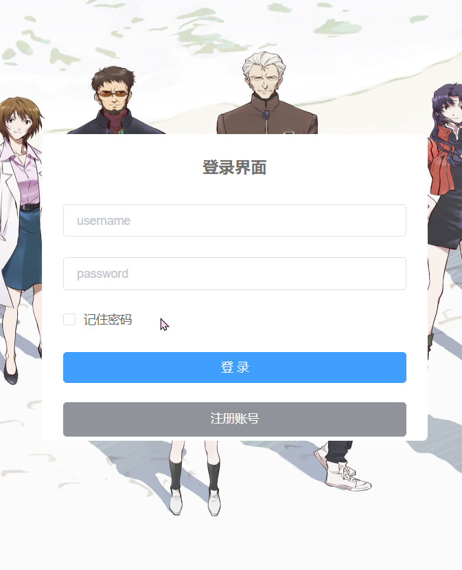
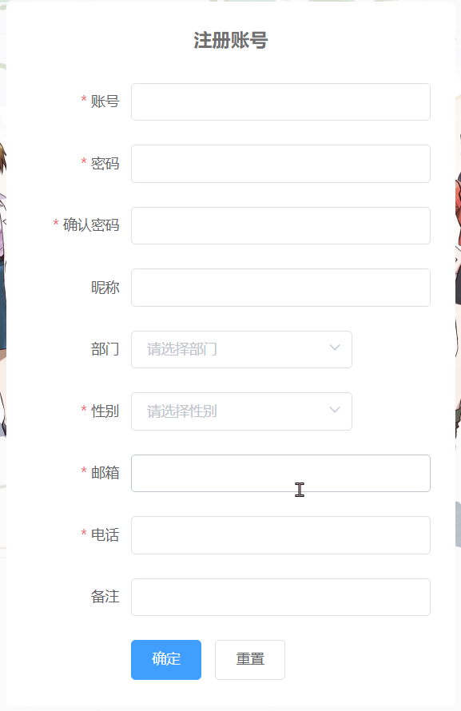
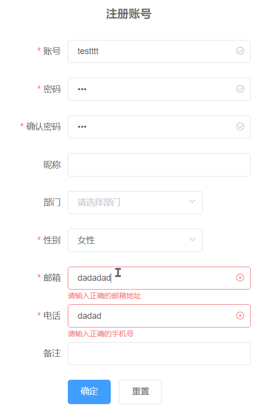
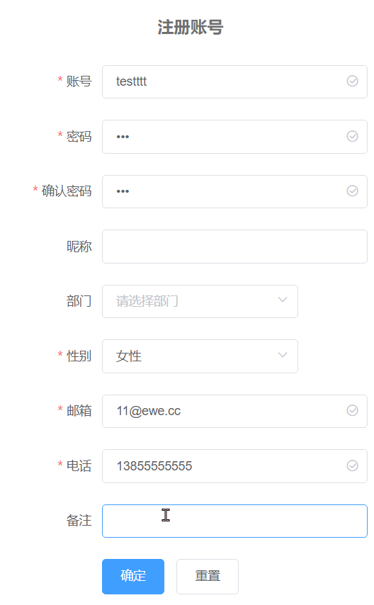

实现一个带有token验证的登录功能

<!-- more -->

## 登录和注册界面

### 界面展示




利用前后端分离的特点，在输入完数据，失去光标的时候进行信息格式和重复检验。


## 实现代码

### 加密代码

前端对输入的密码加密。
``` js
import JSEncrypt from "jsencrypt/bin/jsencrypt.min";

// 密钥对生成 http://web.chacuo.net/netrsakeypair

const publicKey =
    "MIGfMA0GCSqGSIb3DQEBAQUAA4GNADCBiQKBgQDc+7YVSx7IOGsmzRMn1lKdhGX4" +
    "EwYj5d/Z4QgCR5gFC7Ae6rXqdG6QmyEABNh3Z7LDXGyiaN/W/9xE+1ixcqGQJrp8" +
    "EWgiACWhFXd4JJp/viU2/t8cUpdMxKv+U3fyh5k1vqDQaRzDI7jHz663WU1csWM/" +
    "+2yfiPgM7o8dYApG3wIDAQAB";

const privateKey =
    "MIICdQIBADANBgkqhkiG9w0BAQEFAASCAl8wggJbAgEAAoGBANz7thVLHsg4aybN" +
    "EyfWUp2EZfgTBiPl39nhCAJHmAULsB7qtep0bpCbIQAE2HdnssNcbKJo39b/3ET7" +
    "WLFyoZAmunwRaCIAJaEVd3gkmn++JTb+3xxSl0zEq/5Td/KHmTW+oNBpHMMjuMfP" +
    "rrdZTVyxYz/7bJ+I+Azujx1gCkbfAgMBAAECgYBTaQssdGNVDb6cMbH2SnZ6kDvw" +
    "7DVYHW9mDQN54M4nsWaz9MHfkj0dhgBpwmp2f4TBKsSydMVwoLjirMCoke0bCV6H" +
    "r1Qj6pc5hSQSRmyeA6LY6hqdSxr4Dhp22qNZOOT8OuyOuJ+Rw5OnpLHGkYQ+BPnN" +
    "VQgd1K94svorhu/LAQJBAPfQLuwA8vWZe9vfsJ2pRQucwK1Jx7N2KHs1gr3TVb0N" +
    "9cUGMjQ4V/J1/NkiPlWRBc5JAU928iePVp8Z/Km3mV8CQQDkSJ7SI0rp2plbMIZA" +
    "bRxvRvVfTOpXc1IJ373WQl9BGTQ9hpthJsA/jwfaKvPc7ez21E3QV3cVAAzP23kP" +
    "NMKBAkAoShmG1zSpB3YirkCJsX5/P9H3mno0TC6SsYV7FUPoQ7/Ec5hv8wUhb1tX" +
    "dgDKapSWEDp9T+pY0i4UGeaBNU9jAkBfyICrFxfVq1zxQBj0a1Ok9Rb7V6Bz9PUV" +
    "I4XZopupCtQ6hIIpb0L26CKZTbBooIPuxQGpSymx7AV0KVhQIwkBAkBJF5LIIkjR" +
    "LMBTB6QokxIwhlVdoU9SDM++dV9Hp5BECR39eOVhpyVbxsFXT7AilEKvJiczMrP2" +
    "t9+KJcjXgjgu";

// 加密
export function encrypt(txt) {
    const encryptor = new JSEncrypt();
    encryptor.setPublicKey(publicKey); // 设置公钥
    return encryptor.encrypt(txt); // 对数据进行加密
}

// 解密
export function decrypt(txt) {
    const encryptor = new JSEncrypt();
    encryptor.setPrivateKey(privateKey); // 设置私钥
    return encryptor.decrypt(txt); // 对数据进行解密
}
```

### token获取

```js
Login({ commit }, loginInfo) {
	const username = loginInfo.username.trim();
	const password = loginInfo.password;
	return new Promise((resolve, reject) => {
		login(username, password)
			.then(res => {
				setToken(res.data);
				commit("SET_TOKEN", res.data);
				resolve();
			})
			.catch(error => {
				reject(error);
			});
	});
},
```

### token添加到请求头

```js
    // 是否需要设置 token
    const isToken = (config.headers || {}).isToken === false;
    if (getToken() && !isToken) {
      config.headers["Authorization"] = "Bearer " + getToken(); // 让每个请求携带自定义token 请根据实际情况自行修改
    }
```

### SpringSecurity对路由检验

```java
@Override
protected void configure(HttpSecurity httpSecurity) throws Exception {
  httpSecurity
    // CSRF禁用，因为不使用session
    .csrf().disable()
    // 认证失败处理类
    .exceptionHandling().authenticationEntryPoint(unauthorizedHandler).and()
    // 基于token，所以不需要session
    .sessionManagement().sessionCreationPolicy(SessionCreationPolicy.STATELESS).and()
    // 过滤请求
    .authorizeRequests()
    // 对于登录login 验证码captchImage 允许匿名访问
    .antMatchers("/login").anonymous().antMatchers("/system/**", "/company/**").anonymous()
    .antMatchers("/druid/**").permitAll()
    // 除上面外的所有请求全部需要鉴权认证
    .anyRequest().authenticated().and().headers().frameOptions().disable();
  // 添加JWT filter
  httpSecurity.addFilterBefore(authenticationTokenFilter, UsernamePasswordAuthenticationFilter.class);
}
```

### 对请求进行过滤

```java
protected void doFilterInternal(HttpServletRequest request, HttpServletResponse response, FilterChain chain) throws ServletException, IOException {
  LoginUser loginUser = null;
  try {
    loginUser = tokenService.getLoginUser(request);
  } catch (ClassCastException e) {
  }
  if (StringUtils.isNotNull(loginUser)) {
    tokenService.verifyToken(loginUser);
  }
  chain.doFilter(request, response);
}

```

### token操作

有关token的操作，将用户和token存储在redies中，分析请求是否带有token，是否过期失效等。如果有解析token获取相关的uuid，userkey获得user数据。
```java
public String createToken(LoginUser loginUser) {
  String uuid = IdUtils.fastUUID();
  loginUser.setToken(uuid);
  refreshToken(loginUser);
  Map<String, Object> claims = new HashMap<>();
  claims.put(Constants.LOGIN_USER_KEY, uuid);
  return createToken(claims);
}

private String createToken(Map<String, Object> claims) {
  String token = Jwts.builder().setClaims(claims).signWith(SignatureAlgorithm.HS512, secret).compact();
  return token;
}

public void verifyToken(LoginUser loginUser) {
  long expireTime = loginUser.getExpireTime();
  long currentTime = System.currentTimeMillis();
  if (expireTime - currentTime <= MILLIS_MINUTE_TEN) {
    refreshToken(loginUser);
  }
}

public void refreshToken(LoginUser loginUser) {
  loginUser.setLoginTime(System.currentTimeMillis());
  loginUser.setExpireTime(loginUser.getLoginTime() + expireTime * MILLIS_MINUTE);
  // 根据uuid将loginUser缓存
  String userKey = getTokenKey(loginUser.getToken());
  redisCache.setCacheObject(userKey, loginUser, expireTime, TimeUnit.MINUTES);
}

public LoginUser getLoginUser(HttpServletRequest request) throws ClassCastException {
  // 获取请求携带的令牌
  String token = getToken(request);
  if (StringUtils.isNotEmpty(token)) {
    Claims claims = parseToken(token);
    // 解析对应的权限以及用户信息
    String uuid = (String) claims.get(Constants.LOGIN_USER_KEY);
    String userKey = getTokenKey(uuid);
    LoginUser user = redisCache.getCacheObject(userKey);
    return user;
  }
  return null;
}


private String getToken(HttpServletRequest request) {
  String token = request.getHeader(header);
  if (StringUtils.isNotEmpty(token) && token.startsWith(Constants.TOKEN_PREFIX)) {
    token = token.replace(Constants.TOKEN_PREFIX, "");
  }
  return token;
}

private Claims parseToken(String token) {
  return Jwts.parser().setSigningKey(secret).parseClaimsJws(token).getBody();
}

public void delLoginUser(String token) {
  if (StringUtils.isNotEmpty(token)) {
    String userKey = getTokenKey(token);
    redisCache.deleteObject(userKey);
  }
}

private String getTokenKey(String uuid) {
  return Constants.LOGIN_TOKEN_KEY + uuid;
}

```

