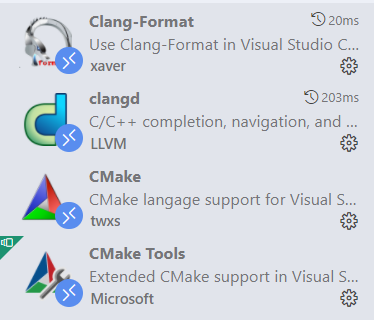

太舒服了，有史以来最舒服的了。

**雪代巴是真美啊**！

<!-- more -->

## 直击我内心的C/C++环境配置

### 与VSCode的纠缠

选择VSCode的原因很简单，应为界面很好看，我觉得非常的好看，大一刚开始用```dev/codeblock```就感觉很丑，然后在网上看到```VSCode```后就彻底喜欢上了（尽管在很多地方又不方便）。

原先要在```windows```上使用```VSCode```编写```C/C++```代码要干的事情还挺多的，特别是初学的时候简直一脸懵，配环境变量（用上了```linux```才对环境变量是什么有点理解，不知道为什么刚开始没去搜:yawning_face:），```VSCode```里还要配置一堆路径，要不是好看真的坚持不下去。

刚开始配完用起来还是很熟似的，后面不知道怎么了静态分析功能出毛病了，分析时间间隔短了，写起来界面就卡卡的。然后就转向了```clang-tidy```，但是它不能边写代码边分析，需要保存了才能分析。再就是转向```clangd```了，又但是，它自带了```format```功能，而且默认的```tab width```是```2```，当时就极其不舒服，去改了源码改了巨无霸就还是没成功。就选择了```clang-tidy```。**现在感觉```tab width = 2```真香**。

后面接触到了```WSL```，```linux```也用熟了，命令行真舒服。就转向了```WSL+VSCode```了。对文件和路径管理就可以```VSCode```完成了，写代码也有很流畅的静态分析和代码提示。在```WSL```里文件库的引用问题也会少很多，环境变量也不用怎么配置。**而且界面太符合我的审美了！**

### WSL选择

在商城里选择了```Ubuntu 22.04```版本，下过来一定要把挂载的磁盘改掉！

在```WSL```里下载```clang,clang-tidy,clang-format```。最好是直接安装在全局环境变量的文件夹里。

### VSCode的配置

用```Remote```功能连接到```WSL```后，下载如下插件。配置好```clang-format```的路径，想要的格式什么什么的。
安装clangd和clangd-format

```bash
sudo apt-get install clangd-12
sudo apt-get install clangd-format
```

替换clangd

```bash
sudo update-alternatives --install /usr/bin/clangd clangd /usr/bin/clangd-12 100
```




**然后差不多就可以用辣！**