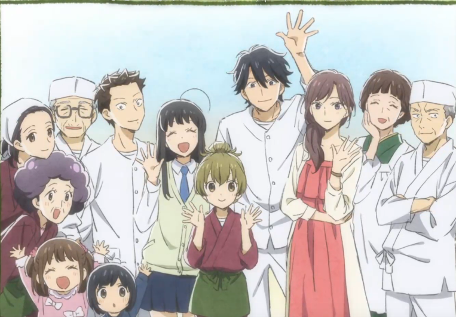

## 相合之物

我错了，四月最强新番spy，夏日重现都靠边，还得看相合之物，女儿前女友jk都存在，整部都是用方言的配音，虽然制作经费肉眼可见的看不见，但是是真的好。一果酱也超级可爱捏。前女友这个几乎不怎么出现的也有很多戏份，连在一起就当大结局的东西哪还会有这种精彩的人物。恋爱脑jk真好真青春。大叔在东京混不下去想回家了，（我也四十多了，过了无所畏惧追逐梦想的年纪了），回家继承家族传统店铺也很好嘛。

## 夏日重现

怎么说夏日重现都该是第一了吧。开播前就有很多人吹了,甚至是新时代的石头门。开播看了一两集，确实好看，去看完了漫画，不长，一下子就看完了。好看是好看但是感觉还是比不上石头门，少了点无限流的绝望感可能是。

死库水是真香。太好了。

## estab life

强烈推荐，很多乐子，也有美少女贴贴,傲娇金毛。存起来一起看。

## 诸葛孔明

前1 2集观感不错，但是再看下有点同质化了，每集都是将一个孔明的计策？

 女主的腿和颜艺是真不错 :sparkling_heart::sparkling_heart::sparkling_heart::sparkling_heart::sparkling_heart::sparkling_heart:

