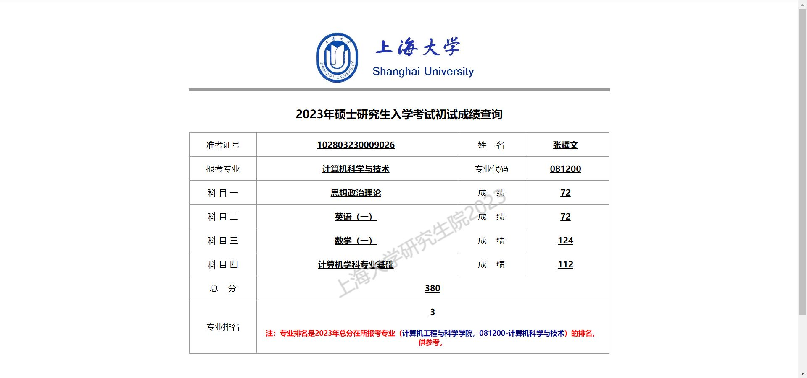

# 经验

## 基本信息

姓名：张耀文

本科专业：计算机科学与技术

获奖经历：省奖学金1次 校奖学金一等1次三等2次

考试科目：11408

初试总分：380

录取院校：上海大学

录取专业：计算机科学与技术 学硕

## 初试经验

考研环境比较重要，我们寝室都考研所以大家就都在寝室复习，省去了挺多路上的时间，起床就可以直接学习了。每天都从早学到晚，生产队的驴都顶不住，我们休息通常固定再周三和周六晚上大家打游戏。虽然说学习效率很重要，但效率也不是说提升就能提升的，时间和效率总得有一个，我不怎么聪明，但我不容易困，就堆时间来学习。

### 择校

选学校和专业还是要尽早确定好，也得搞个备选防止九月份考试科目突然就换掉了，考研模拟考比较少，不知道自己到底什么水平，所以选好了就埋头干就好了别想太多。我原本报考的是华东师范大学，后来写真题心态写崩了就改成了上海大学，最后成绩出来按我这个分数考上的几率也挺大的。

### 政治

政治复习要看数学和408的复习进度来准备，我在8月看徐涛的课，写肖1000，看完大概9月中旬开始看腿姐的基础课和背她的小本子，写肖8肖4老师模拟卷的选择，马原的大题可以早点全部背，其他的在肖4出来后开始背，我背的是腿姐的冲刺班给的知识点，她的大题方法和高考政治比较像我就选了这个。政治复习性价比越晚越高，前期重点还是两门专业课。

### 英语

英语基础我是稀巴烂的那一种，复习就是天天背单词，刚开始上了语法基础课和唐迟的阅读方法论，背单词背完一轮开始写真题阅读，一天一篇，写完看唐迟讲，写完一轮阅读学小三门，完型翻译新题型看谁都差不多，然后就再写真题卷两天一张，十月十一月开始搞作文练字，我跟的老师是周思成，我英语比较烂就没总结什么作文模板啥的就背他给的作文。

### 数学

选个适合自己的老师，一直学完基础和强化课，我高数跟武忠祥，线代跟李永乐，概率论跟王式安（不是很理想听说方浩不错）。3月-6月差不多是在基础复习，听课写例题，习题册就写了660和880的基础题，基础计算越早重视越好，我以为我到最后会仔细算，但到最后还是一堆抄少了抄错了看错了的计算错误。7月到9月上强化课，写了880另一部分和武老师的严选题，10月开始写限时真题，真题写完写模拟题，大概两天一张或者三天两张，模拟题我就买了李林的还没有写完。感觉当时时间规划不怎么好，基础最后搞得乱七八糟的不如早点强化，早点写真题。

### 408

408需要的复习时间和数学得差不多，但我408五月多才开始学，花在408上的精力比较少考的也比较烂。基础强化就跟王道课写王道题。基础课我没有全部都看视频，就挑了一些看，强化课的操作系统和组成原理课都上完了，咸鱼讲得很好，楼楼懂得都懂。上完课就写真题，根据自己的错题看书，408知识点多，但特别难的没有多少，需要反复看书总结成自己得知识才能记得久点。

## 复试经验

上海大学复试要考编译原理和c++上机，编译原理笔试主要看下书和视频课，写一写报考学校的期末试卷，机试刷一下学校的oj或者写acwing里的算法基础课。面试我只准备了英文自我介绍和自我介绍找学长以前问题汇总，都差不了太多，项目和学过课本的知识点我觉得太多了就完全没看随缘了。